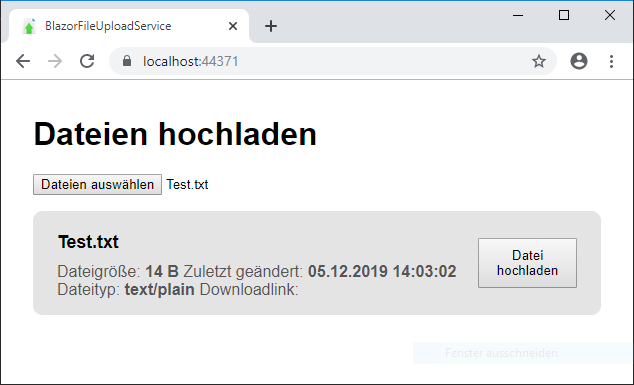
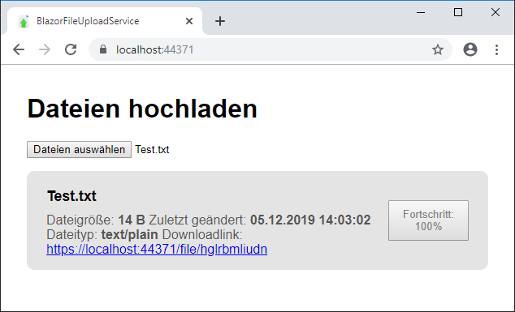
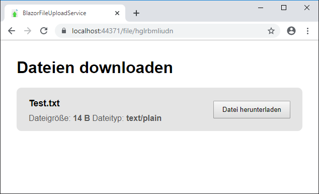

BlazorFileUploadService
====================================

BlazorFileUploadService is a project to provide a simple file-sharing service using [Blazor](https://github.com/aspnet/Blazor).
The project was written and tested in .NetCore 3.0.

The project is heavily based on the [BlazorInputFile](https://github.com/SteveSandersonMS/BlazorInputFile) code from [@SteveSandersonMS](https://github.com/SteveSandersonMS).

## Screenshots:

## Inspired by:
* https://bayfiles.com/
* https://anonfiles.com/
* https://openload.cc/
* https://letsupload.cc/
* https://megaupload.nz/
* https://share-online.is/
* https://rapidshare.nu/
* https://forumfiles.com/

## Further links:
* https://blog.stevensanderson.com/2019/09/13/blazor-inputfile/
* https://github.com/SteveSandersonMS/BlazorInputFile
* https://www.nuget.org/packages/BlazorInputFile
* https://docs.microsoft.com/en-us/dotnet/api/system.io.path.getrandomfilename?redirectedfrom=MSDN&view=netcore-3.0#System_IO_Path_GetRandomFileName

Change history
--------------

* **Version 1.0.0.0 (2019-12-05)** : 1.0 release.
* **Version 1.0.0.0 (2019-06-21)** : Created project.